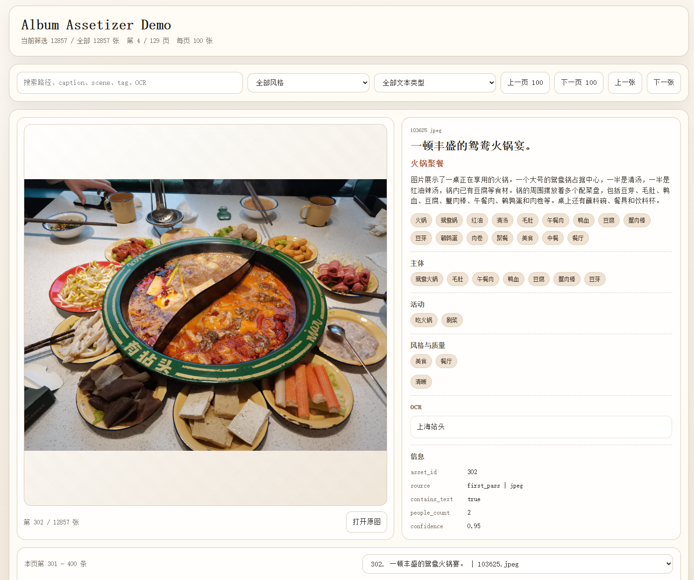

# Album Assetizer

> Turn personal albums into reusable semantic data assets.

把个人相册转化为可长期复用的语义数据资产。

[](LICENSE)
[](https://www.python.org/)

## 这是什么

`album-assetizer` 扫描本地相册，调用大模型生成结构化描述，将结果持久化为本地数据资产。

输出为标准格式（JSONL / CSV / SQLite），可直接用于下游检索、聚类、推荐等场景。下游应用不在本项目范围内，会作为独立项目提供。

## 效果展示



## 快速开始

```bash
cd album-assetizer
python -m pip install -e .

# 配置 API（参考 examples/sample.env）
cp examples/sample.env .env

# 使用
album-assetizer --root /path/to/album scan       # 扫描素材
album-assetizer --root /path/to/album annotate   # 生成描述
album-assetizer --root /path/to/album export     # 导出结果
album-assetizer --root /path/to/album stats      # 查看统计
```

## 输出字段

每个素材生成一条结构化记录：

| 字段 | 说明 |
|------|------|
| `caption_short` | 一句话简短描述 |
| `caption_long` | 详细描述，适合检索和回顾 |
| `scene` | 场景分类 |
| `tags` | 语义标签（6-18 个，去重） |
| `main_subjects` | 画面主体 |
| `activities` | 正在发生的活动 |
| `style_labels` | 风格标签（截图、黑白、HDR 等） |
| `quality_flags` | 质量标记（模糊、过曝等） |
| `safety_flags` | 安全标记 |
| `contains_text` | 是否包含文字 |
| `ocr_text` | OCR 识别文字（≤300 字） |
| `people_count` | 人数（-1 表示无法判断） |
| `confidence` | 置信度 (0-1) |
| `embedding_text` | 拼接全字段的 embedding 文本 |

## 核心能力

- 扫描本地相册，支持 JPG / PNG / HEIC / DNG / CR3 / LIVP（Apple Live Photo）
- 图片预处理：缩放、格式转换、EXIF 校正、体积控制
- 调用 OpenAI 兼容 API，支持 Structured Output（json_schema）
- 并发处理 + RPM 速率限制 + 自动扩缩容
- 指数退避重试，错误分类（可重试 vs 永久失败）
- 崩溃恢复：重启后自动恢复中断任务
- 首轮视觉生成 + 二轮文本精修
- 优雅停机（SIGINT/SIGTERM 信号处理）
- 结果写入 SQLite，导出 JSONL / CSV
- 连通性预检（text smoke + image smoke）
- 轻量审阅脚本用于人工抽检

## 审阅脚本

```bash
python3 scripts/render_review_html.py \
  --jsonl /path/to/results.jsonl \
  --image-root /path/to/album_root \
  --output review.html
```

生成静态 HTML，支持分页、关键词筛选、键盘导航。用于 Prompt 评估和质量抽检。

## 项目结构

```text
album-assetizer/
├── src/album_assetizer/
│   ├── cli.py            # CLI 入口
│   ├── config.py         # 运行时配置
│   ├── db.py             # SQLite 数据层
│   ├── exporters.py      # JSONL/CSV 导出
│   ├── prompts.py        # LLM 提示词
│   ├── repository.py     # 数据持久化
│   ├── runtime.py        # 工具函数
│   └── schemas.py        # 输出字段定义
├── scripts/
│   └── render_review_html.py
├── tests/
├── examples/sample.env
├── pyproject.toml
├── ROADMAP.md
└── CONTRIBUTING.md
```

## 项目边界

本项目只做语义资产的生成与持久化。以下能力作为独立项目提供：

- 相册可视化与前端展示
- 语义检索 / 聚类 / 推荐 / 时间线
- 完整 Web 相册产品

## 路线图

详见 [ROADMAP.md](ROADMAP.md)。

## 参与贡献

详见 [CONTRIBUTING.md](CONTRIBUTING.md)。

## License

[MIT](LICENSE)

## 社区

本项目在 [LINUX DO](https://linux.do) 社区发布与推广，感谢社区佬友们的支持与反馈。

## 社区

本项目在 [LINUX DO](https://linux.do) 社区发布与推广，感谢社区佬友们的支持与反馈。
